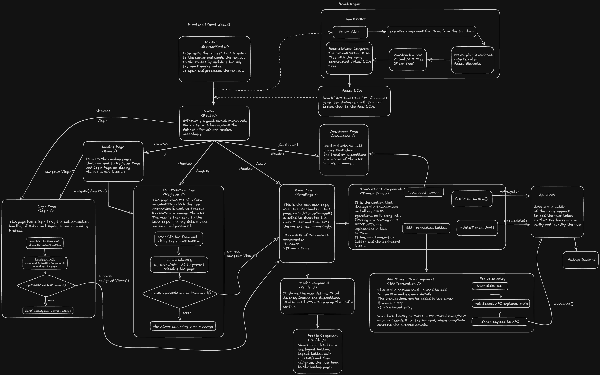
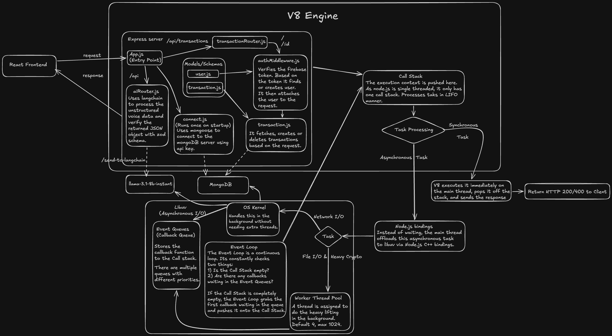

# 🚀 PockIt – Voice-Powered Expense Tracker

Manually entering expenses is tedious, and friction is the main reason people stop tracking their spending. **PockIt** is a full-stack personal expense tracker that solves this by allowing users to log expenses using just their voice. 

Built with the MERN stack and LangChain, PockIt converts unstructured voice commands (e.g., *"Spent 800 rupees on auto yesterday"*) into structured data and securely logs it to a database.

## 📁 Project File Structure
```text
📁 pockit/
├── 📁 backend/
│   ├── 📁 controllers/
│   │   └── 📄 transaction.js
│   ├── 📁 db/
│   │   └── 📄 connect.js
│   ├── 📁 middleware/
│   │   └── 📄 authMiddleware.js
│   ├── 📁 models/
│   │   ├── 📄 user.js
│   │   └── 📄 transaction.js
│   ├── 📁 routes/
│   │   ├── 📄 transactionsRouter.js
│   │   └── 📄 aiRouter.js
│   └── 📄 app.js
│
└── 📁 frontend/
    ├── 📁 src/
    │   ├── 📁 axios/
    │   │   └── 📄 api.jsx
    │   ├── 📁 components/
    │   │   ├── 📄 Header.jsx
    │   │   ├── 📄 Transaction.jsx
    │   │   ├── 📄 AddTransaction.jsx
    │   │   └── 📄 Profile.jsx
    │   ├── 📁 pages/
    │   │   ├── 📄 register.jsx
    │   │   ├── 📄 login.jsx
    │   │   ├── 📄 HomePage.jsx
    │   │   ├── 📄 Home.jsx
    │   │   └── 📄 Dashboard.jsx
    │   ├── 📄 App.jsx
    │   ├── 📄 firebase.js
    │   ├── 📄 index.css
    │   └── 📄 main.jsx
    ├── 📄 package.json
    └── 📄 vite.config.js
```

## ✨ Key Features
* **🎙️ Voice-to-Data Logging:** Uses Web Speech API and LangChain to extract transaction details (Amount, Category, Vendor, Date) from natural speech.
* **🔐 Secure Authentication:** Firebase-powered email/password authentication with JWT token verification on the backend.
* **📊 Dashboard & Visualization:** Track income vs. expenses visually using Recharts.
* **⚡ Blazing Fast UI:** A Single Page Application (SPA) built with React and Vite.

## 🛠️ Tech Stack
* **Frontend:** React, Vite, Tailwind CSS, Recharts, Axios (with custom interceptors)
* **Backend:** Node.js, Express.js
* **Database:** MongoDB (Mongoose)
* **AI & Processing:** LangChain, Llama 3.1 (via Groq/API), Zod (for schema validation)
* **Authentication:** Firebase Auth & Firebase Admin SDK

---

## 🏗️ System Architecture

### Frontend Architecture
The React frontend handles the SPA experience, routing via React Router, and state management. It communicates securely with the backend using an Axios client that automatically attaches Firebase ID tokens.



### Backend Architecture
The Node.js backend handles concurrent requests efficiently. It verifies Firebase tokens via custom middleware, processes natural language through LangChain, and interfaces with MongoDB.



---

## 🔄 How the Voice Logging Works
1. **Capture:** The user clicks the mic and speaks an expense.
2. **Text Conversion:** The Web Speech API captures the audio and converts it to text.
3. **AI Extraction:** The text payload is sent to the Node.js backend, where LangChain processes the unstructured text against a defined prompt template.
4. **Validation:** Zod validates the AI output to ensure it perfectly matches the `Transaction` schema.
5. **Storage:** The structured JSON is saved to MongoDB, and the React UI updates instantly.

## 📸 Live Demo
https://pock-it.vercel.app/

## 🚀 Getting Started

### Prerequisites
* Node.js installed
* MongoDB connection URI
* Firebase Project (Web credentials + Service Account Key)

### Installation

1. **Clone the repository:**
   ```bash
   git clone [https://github.com/Vegito7110/pockit.git](https://github.com/Vegito7110/pockit.git)
   cd pockit
   ```
2. **Setup the Backend:**
  ```Bash
  cd backend
  npm install
  ```
  Create a .env file in the backend folder:
  
  ```Code snippet
  PORT=5000
  MONGO_URI=your_mongodb_connection_string
  GROQ_API_KEY=your_api_key
  Add your serviceAccount.json from Firebase to the backend root.
  ```
3. **Setup the Frontend:**

  ```Bash
  cd ../frontend
  npm install
  ```
  Create a .env file in the frontend folder:

  ```Code snippet
  VITE_API_URL=http://localhost:5000/api
  VITE_FIREBASE_API_KEY=your_firebase_api_key
  VITE_FIREBASE_AUTH_DOMAIN=your_firebase_auth_domain
  VITE_FIREBASE_PROJECT_ID=your_firebase_project_id
  ...
  ```
4. **Run the Application:**
  Open two terminal windows:

  ```Bash
  # Terminal 1 (Backend)
  cd backend
  npm run dev

  # Terminal 2 (Frontend)
  cd frontend
  npm run dev
  ```
---
## 🚀 Key Engineering Concepts Demonstrated

-JWT authentication using Firebase
-Middleware-based backend architecture
-AI integration into production workflows
-Structured output validation using Zod
-Secure multi-user database design
-Event-driven backend using Node.js
